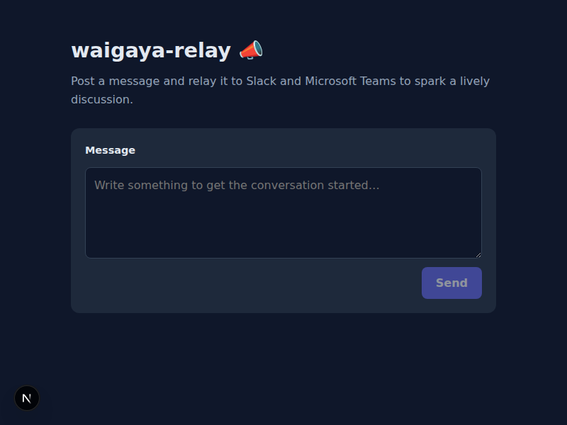
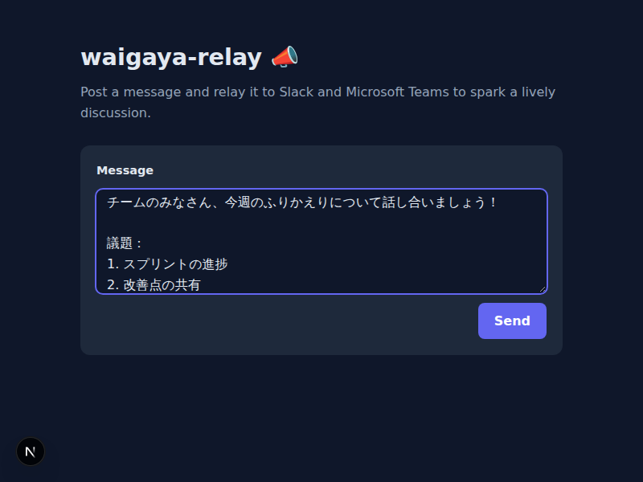
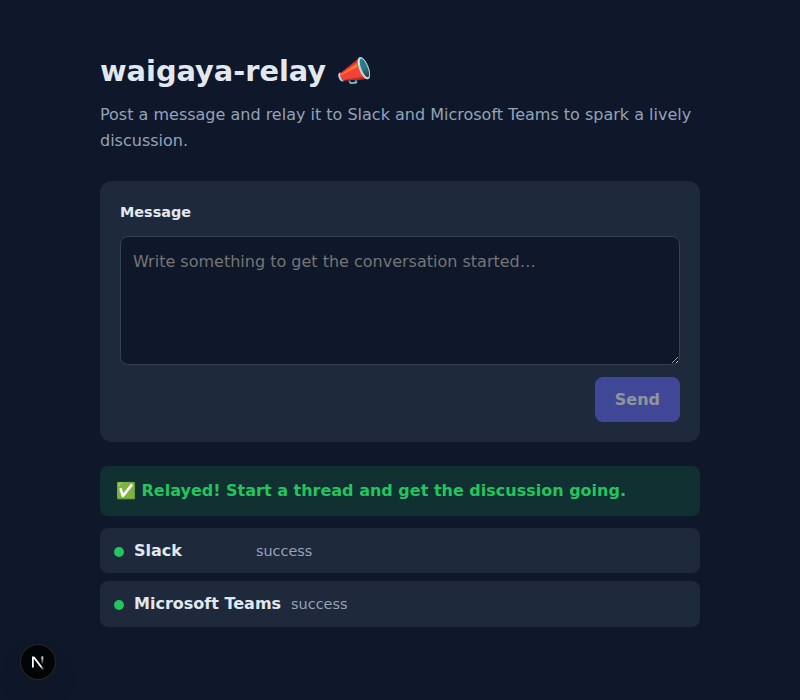

# waigaya-relay 📣

> [English version here](./README.md)

Web のチャット画面に投稿すると、その内容を **Slack** と **Microsoft Teams** に中継し、
それぞれのチャンネルに「スレッドの起点となるメッセージ」を投稿するアプリです。

単なる問い合わせ転送ツールではなく、**「ワイワイガヤガヤと議論が始まる場を作る」** ことを
目的にしています。投稿されたメッセージにチームのメンバーが返信していくことで、
Slack / Teams 上でそのまま議論（スレッド）が始まります。

Next.js（App Router）で実装しており、**Vercel にそのままデプロイ**できます。

---

## 主な機能

- Web のチャット画面からメッセージを送信できる
- 送信すると **Slack** と **Microsoft Teams** の両方に投稿される
- Slack / Teams 側では、その投稿を起点にスレッド形式で会話を始められる
- Slack / Teams のどちらか一方が失敗しても、もう一方の結果は画面に表示される
  （成功 / 失敗 / スキップを個別に確認できる）

---

## 技術スタック

- [Next.js 14](https://nextjs.org/)（App Router）/ React 18
- TypeScript
- Slack / Microsoft Teams の Incoming Webhook
- ホスティング: [Vercel](https://vercel.com/)

---

## 使い方

### 1. チャット画面を開く

アプリの URL（ローカルなら `http://localhost:3000`、デプロイ後は Vercel の URL）にアクセスします。メッセージ入力画面が表示されます。



### 2. メッセージを入力する

投稿したいメッセージを入力します。改行を使って構造的に書くことができ、入力した内容がそのまま各プラットフォームに中継されます。



### 3. 「Send」ボタンを押して結果を確認する

**Send** ボタンをクリックすると、Slack と Microsoft Teams それぞれの中継結果がすぐに表示されます。Webhook URL が未設定の中継先は **skipped**（スキップ）と表示されます。



| ステータス | 意味 |
| ---------- | ---- |
| `success`  | メッセージの配信に成功した |
| `failed`   | 配信に失敗した（詳細メッセージを確認してください） |
| `skipped`  | Webhook URL が未設定のため中継をスキップした |

### 4. Slack / Teams で返信してスレッドを始める

メッセージが Slack チャンネルや Teams チャンネルに届いたら、チームメンバーがそのメッセージにスレッドで返信できます。中継したメッセージが議論のきっかけとなり、ワイワイガヤガヤが始まります。

---

## セットアップ方法

### 1. 必要なもの

- Node.js 20 以上
- Slack の Incoming Webhook URL（任意）
- Microsoft Teams の Incoming Webhook URL（任意）

> Slack / Teams のどちらか一方だけでも動作します。未設定の中継先は自動的にスキップされます。

### 2. 依存パッケージのインストール

```bash
npm install
```

### 3. 環境変数の設定

`.env.example` を `.env.local` にコピーして、Webhook URL を設定します。

```bash
cp .env.example .env.local
```

`.env.local` を編集します。

```dotenv
SLACK_WEBHOOK_URL=https://hooks.slack.com/services/xxxx/xxxx/xxxx
TEAMS_WEBHOOK_URL=https://outlook.office.com/webhook/xxxx/IncomingWebhook/xxxx/xxxx
```

> ⚠️ `.env.local` は `.gitignore` 済みです。**Webhook URL は絶対にコミットしないでください。**

#### Webhook URL の取得方法

- **Slack**: [Incoming Webhooks](https://api.slack.com/messaging/webhooks) の手順に従い、
  投稿先チャンネルを選んで Webhook URL を発行します。
- **Microsoft Teams**: 投稿したいチャンネルの「コネクタ」から
  **Incoming Webhook** を追加して URL を発行します。

---

## 環境変数の説明

| 変数名              | 必須 | 説明                                                              |
| ------------------- | ---- | ----------------------------------------------------------------- |
| `SLACK_WEBHOOK_URL` | 任意 | Slack Incoming Webhook の URL。未設定なら Slack への中継をスキップ。 |
| `TEAMS_WEBHOOK_URL` | 任意 | Teams Incoming Webhook の URL。未設定なら Teams への中継をスキップ。 |

- 少なくともどちらか一方を設定してください（両方未設定だと、すべてスキップとなり失敗します）。
- ローカルでは `.env.local`、Vercel では **Project → Settings → Environment Variables** に登録します。

---

## 起動方法（ローカル）

開発サーバーを起動します。

```bash
npm run dev
```

ブラウザで [http://localhost:3000](http://localhost:3000) を開きます。

本番ビルドを試す場合:

```bash
npm run build
npm start
```

その他のコマンド:

```bash
npm run typecheck   # 型チェックのみ
```

---

## 動作確認方法

1. `npm run dev` でサーバーを起動する。
2. ブラウザで [http://localhost:3000](http://localhost:3000) を開く。
3. 入力欄にメッセージを書いて「送信する」を押す。
4. 画面下部に中継結果（Slack / Teams それぞれ 成功 / 失敗 / スキップ）が表示される。
5. Slack / Teams のチャンネルにメッセージが届いていることを確認する。
6. 届いたメッセージに返信して、スレッドで議論を始める。

API を直接叩いて確認することもできます。

```bash
curl -X POST http://localhost:3000/api/messages \
  -H "Content-Type: application/json" \
  -d '{"message":"はじめての投稿です！"}'
```

レスポンス例:

```json
{
  "ok": true,
  "results": [
    { "target": "slack", "ok": true, "skipped": false },
    { "target": "teams", "ok": true, "skipped": false }
  ]
}
```

---

## Vercel へのデプロイ

1. このリポジトリを GitHub に push する。
2. [Vercel](https://vercel.com/) で **New Project** からこのリポジトリを import する。
   （Next.js は自動検出されるので、ビルド設定は変更不要です）
3. **Settings → Environment Variables** に `SLACK_WEBHOOK_URL` と
   `TEAMS_WEBHOOK_URL` を登録する。
4. **Deploy** を実行する。

デプロイ後は発行された URL でチャット画面を利用できます。
環境変数を変更した場合は再デプロイしてください。

---

## セキュリティ上の注意点

- **Webhook URL はシークレットです。** コードに直接書かず、必ず環境変数で渡してください。
- `.env*` は `.gitignore` 済みです。リポジトリにコミットしないでください。
- 中継処理はサーバー側（API Route）でのみ実行し、Webhook URL をブラウザに渡しません。
  フロントエンドは `/api/messages` だけを呼び出します。
- Webhook URL はログに出力しないようにしています。
- このプロトタイプには **認証・レート制限はありません**。社内ツールとして限定的に使うか、
  公開する場合は認証・レート制限などを別途追加してください。
  （Vercel では HTTPS が標準で有効です）

---

## ディレクトリ構成

```
waigaya-relay/
├── app/
│   ├── layout.tsx                 # ルートレイアウト
│   ├── page.tsx                   # チャット画面（クライアントコンポーネント）
│   ├── globals.css                # スタイル
│   └── api/messages/route.ts      # メッセージ送信 API (POST)
├── lib/
│   ├── config.ts                  # 環境変数の読み込み
│   ├── types.ts                   # 共有の型定義
│   └── relay/
│       ├── slack.ts               # Slack Webhook 投稿
│       └── teams.ts               # Teams Webhook 投稿
├── docs/plan/                     # 実装計画
├── .env.example
├── next.config.mjs
├── package.json
└── tsconfig.json
```

実装計画は [`docs/plan/20260529_waigaya-relay.md`](./docs/plan/20260529_waigaya-relay.md) を参照してください。

---

## ライセンス

[MIT](./LICENSE)
